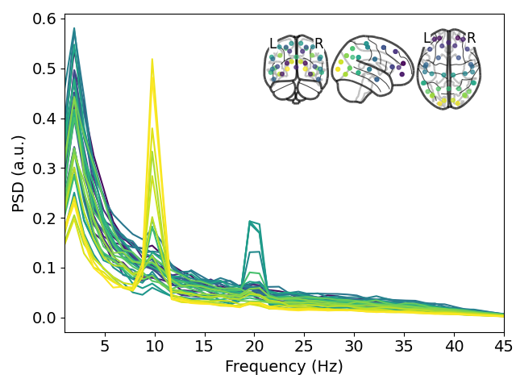

# Scripts to simulate MEG data

Here, we simulate source space data and project it to MEG sensors. We then perform source reconstruction with OSL to check we recover the ground truth.

We use the leadfields from a real forward model to project the source data to the sensors.

## Installation

To run these scripts you need to install OSL (as well as other dependencies such as FSL). To do this, please follow the instructions [here](https://osl.readthedocs.io/en/latest/install.html).

## Results

We simulate 1/f noise and add 10 Hz activity in occiptial parcels and 20 Hz activity in motor parcels. We get the following parcel-space PSD after source reconstructing the simulated sensor data:

